# Projet Architecture Big Data "Berbère Lab"
## Objectif du projet

Projet d'analytics end-to-end pour une entreprise du secteur Food & Beverage, déployé sur Snowflake. Ce projet met en œuvre une architecture data moderne en trois phases : l'ingestion de données multi-sources (CSV et JSON) depuis un bucket S3, la transformation et le nettoyage selon des règles de qualité strictes (médaillon architecture Bronze/Silver), et enfin l'exploitation via des analyses SQL avancées et des dashboards interactifs Streamlit.

L'objectif est de fournir une vision 360° de l'activité commerciale en croisant plusieurs dimensions métier : performance des ventes, efficacité marketing, impact des promotions, satisfaction client, et optimisation logistique. Les dashboards permettent aux décideurs de piloter l'activité en temps réel grâce à des KPIs actionnables et des filtres dynamiques, tout en offrant la possibilité d'exporter les données pour des analyses complémentaires.


## Architecture Technique

### Stack technologique
- **Plateforme Cloud** : Snowflake
- **Langage SQL** : Snowflake SQL
- **Dashboards** : Streamlit (natif Snowflake)
- **Warehouse** : WH_BRB_LAB (XSMALL, auto-suspend 60s)

### Structure de la base de données

```
BERBERE_LAB (Database)
│
├── BRONZE (Schema)                    # Données brutes
│   ├── customer_demographics           # CSV - 9 tables CSV
│   ├── customer_service_interactions   # CSV
│   ├── financial_transactions          # CSV
│   ├── promotions_data                 # CSV
│   ├── marketing_campaigns             # CSV
│   ├── product_reviews                 # CSV
│   ├── logistics_and_shipping          # CSV
│   ├── supplier_information            # CSV
│   ├── employee_records                # CSV
│   ├── inventory                       # JSON (colonisé)
│   └── store_locations                 # JSON (colonisé)
│
└── SILVER (Schema)                    # Données nettoyées
    ├── customer_demographics_clean
    ├── customer_service_interactions_clean
    ├── financial_transactions_clean
    ├── promotions_clean
    ├── marketing_campaigns_clean
    ├── product_reviews_clean
    ├── logistics_and_shipping_clean
    ├── supplier_information_clean
    ├── employee_records_clean
    ├── inventory_clean
    └── store_locations_clean
```

---

##  Organisation des fichiers

### Scripts SQL
### load_data.sql
 **setup_snowflake**
   - Création de la database BERBERE_LAB
   - Création des schémas BRONZE et SILVER
   - Configuration du warehouse WH_BRB_LAB
   - Création du stage S3 (STG_FOOD_BEVERAGE)

 **Create_table**
   - Définition des 11 tables dans le schéma BRONZE
   - Typage des colonnes avec PRIMARY KEY

 **Chargement de données**
   - Chargement des données depuis S3 vers BRONZE

### clean_data.sql
   - **Nettoyage BRONZE → SILVER** avec :
     - Gestion des doublons (ROW_NUMBER)
     - Traitement des valeurs nulles (TRIM, NULLIF)
     - Validation des données (montants ≥ 0, notes ∈ [1-5])
     - Cohérence des dates (start_date ≤ end_date)


### Compréhension_des_jeux_de_données.sql
Analyse de la qualité et profil des données :

**Vue d'ensemble par table** : volumétrie, périodes couvertes, clés distinctes


**Analyse de qualité** : identification des valeurs manquantes par colonne

**Distributions** : analyse par dimension selon la nature de chaque table
- Géographique (région, pays)
- Démographique (genre, âge)
- Temporelle (périodes d'activité)

### 5. Analyses_exploratoires_descriptives.sql
Analyses descriptives sur les ventes et clients :

**Évolution temporelle des ventes**

Par mois :
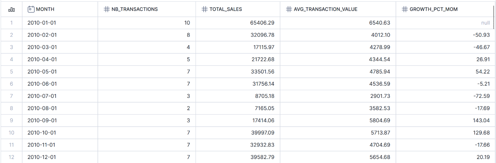

Par trimestre :
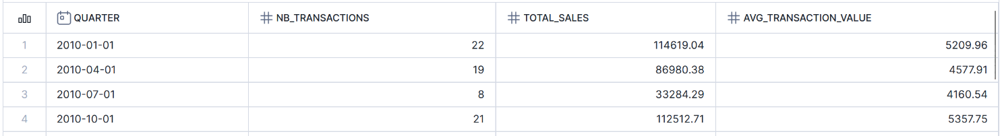

Par jour de la semaine :
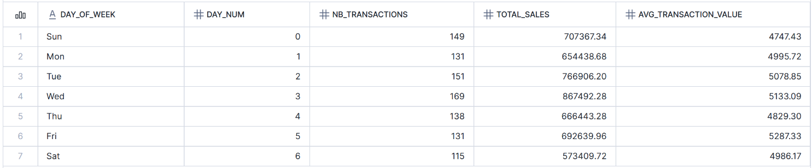

**Performance géographique**

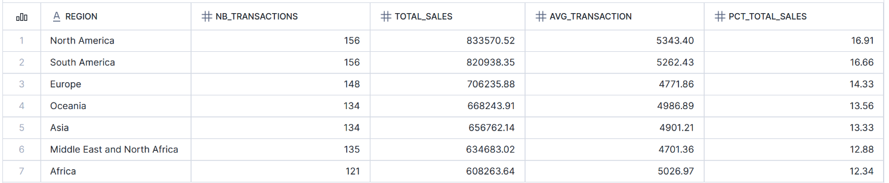

**Segmentation clients**

Par tranche d'âge :
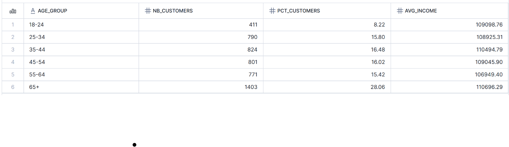

Par niveau de revenu :
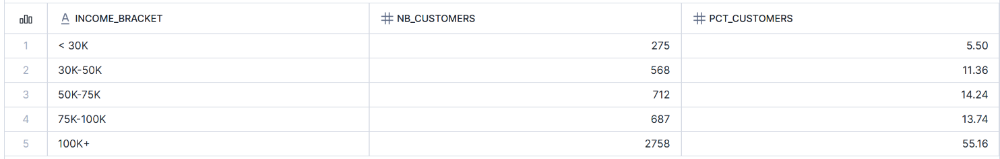

#### 6. Analyses_business_transverses.sql
Analyses métier croisées sur 4 axes :

**2.3.1 - Ventes et Promotions**

Impact des promotions sur les ventes :
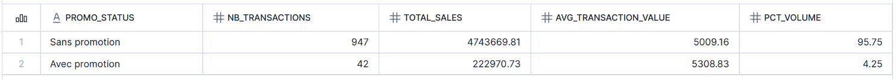

Sensibilité des catégories aux promotions :
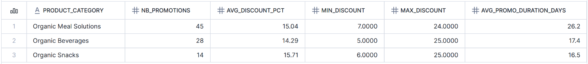

**2.3.2 - Marketing ROI**

Performance des campagnes marketing :
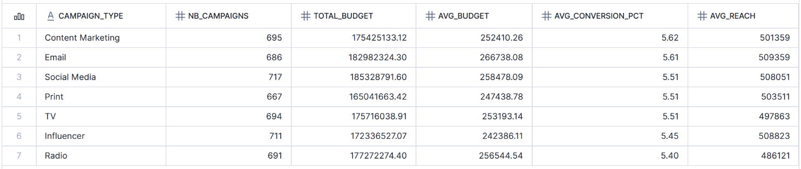

Efficacité par public cible :
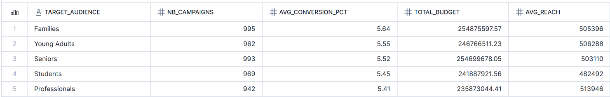

**2.3.3 - Expérience Client**

Distribution des avis produits :
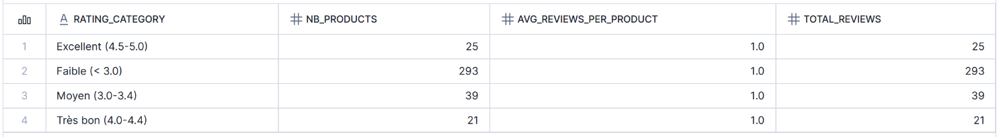

Satisfaction par type d'interaction :
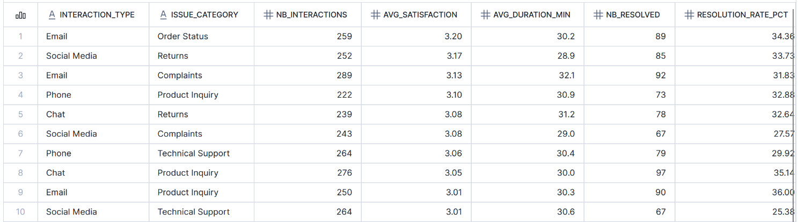

**2.3.4 - Opérations et Logistique**

Ruptures de stock par catégorie :
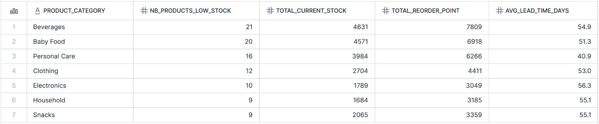

Performance logistique :
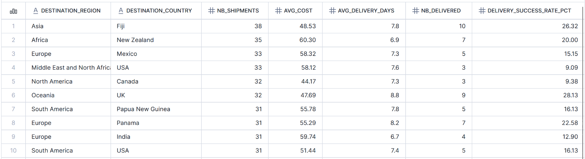

Analyse des retards potentiels :
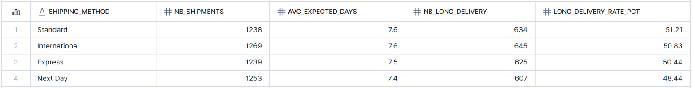

---

## Dashboards Streamlit

### 1. sales_dashboard.py

**Objectif** : Suivi en temps réel des performances commerciales avec filtres interactifs.

**KPIs principaux**
- Chiffre d'affaires total
- Nombre de transactions
- Panier moyen
- Meilleur mois

**Visualisations**
- Évolution mensuelle des ventes
- Performance par région
- Performance par jour de la semaine

**Filtres disponibles**
- Régions géographiques (multi-sélection)
- Modes de paiement
- Montant minimum de transaction

**Fonctionnalités**
- Export CSV des données filtrées
- Tableaux détaillés expandables
- Comparaison Top 3 régions
- Bouton réinitialisation des filtres

---

### 2. marketing_roi.py

**Objectif** : Évaluation de l'efficacité des investissements marketing.

**KPIs principaux**
- Budget total investi
- Ventes générées
- ROI moyen (ratio ventes/budget)
- Portée totale

**Sections d'analyse**

**Top 10 campagnes par ROI** : identification des campagnes les plus rentables

**Performance par type de campagne** : comparaison Email, Social Media, Influencer, Display, etc.

**Performance par public cible** : analyse de la réactivité par segment (Millennials, Familles, Professionnels)

**Alertes automatiques**
- Message d'alerte si ROI < 1 (perte financière)
- Indicateur du budget total concerné

**Recommandations stratégiques**
- Actions à renforcer (campagnes performantes)
- Axes d'amélioration (tests et optimisations)
- Actions à stopper (campagnes non rentables)

**Tableau détaillé** : vue exhaustive de toutes les campagnes avec métriques complètes

---

### 3. promotion_analysis.py

**Objectif** : Analyse de l'impact des stratégies promotionnelles sur les ventes.

**Métriques analysées**
- Impact global des promotions
- Performance par région
- Sensibilité par catégorie produit
- Distribution des niveaux de remise

**Filtres disponibles**
- Régions géographiques
- Catégories de produits
- Types de promotions
- Plage de niveau de remise (slider 0-100%)

**Recommandations dynamiques**

Le dashboard génère des alertes contextuelles :
- Si remise moyenne > 35% : alerte sur l'impact marge
- Si durée moyenne > 20 jours : attention à la banalisation

**Export de données**
- Analyse par catégorie
- Analyse par région
- Distribution des remises

Tous les exports sont au format CSV avec horodatage.

---

## Synthèse des analyses réalisées

### Analyses Exploratoires

**Dimension Ventes**
- Évolution mensuelle et trimestrielle
- Croissance MoM (Month-over-Month)
- Saisonnalité hebdomadaire
- Performance géographique par région

**Interpretation business**
- Les hausses ponctuelles sont cohérentes avec des animations/push marketing ou vagues de promotions.
- La saisonnalité hebdomadaire ouvre des leviers de yield (promos ciblées les jours creux ; limitation des remises les jours forts).

**Dimension Clients**
- Segmentation démographique (âge, genre, revenu)
- Distribution géographique
- Profils socio-économiques

**Interpretation business**
- Les tranches 25–44 sont souvent les plus réactives aux campagnes digitales et sensibles aux promotions limitées. Les tranches à revenu plus élevé réagissent mieux à l’offre premium et aux packs valeur. 

**Dimension Produits**
- Classement par volume d'avis
- Distribution des notes (échelle 1-5)
- Catégories les plus plébiscitées

### Analyses Business Transverses

**Marketing et Promotions**
- ROI Marketing : ratio ventes générées / budget investi
- Impact Promotions : comparaison ventes avec/sans promotion
- Efficacité par canal : taux de conversion par type de campagne
- Sensibilité produits : élasticité aux remises par catégorie

**Interpretation business**
- La dispersion ROI confirme que le mix canal doit être piloté finement : quelques campagnes tirent la perf globale, d’autres diluent le budget. Des segments (ex. Millennials / Familles / Pros) répondent différemment selon canal + offre.

**Expérience Client**
- Satisfaction service : analyse par type d'interaction et catégorie de problème
- Corrélation durée/satisfaction : impact du temps de résolution
- Performance produits : relation entre notation et volume d'avis

**Interpretation business**
Les produits avec fort volume et bonne note sont tes locomotives : ils doivent être mis en avant dans les promos légères/cross-sell. Les produits à note basse impactent la conversion : identifier les causes (qualité, logistique, description).

**Opérations et Logistique**
- Ruptures de stock : taux par catégorie et entrepôt
- Performance livraison : délais par méthode d'expédition et région
- Coûts logistiques : analyse comparative par transporteur

**Interpretation business**
- La performance commerciale est bridée par les ruptures : manque à gagner + dégradation de l’UX. Les délai/retards affectent à la fois la conversion (coût d’opportunité) et la satisfaction (avis).

# Phase 3 – Data Product & Machine Learning
Cette phase vise à créer un **data product centralisé** combinant ventes, promotions, marketing et dimensions clés, prêt à être consommé par :

- Outils analytiques (dashboards, reporting)
- Modèles Machine Learning
- Équipes métier (marketing, commercial, data science)

## 1 – Création du Data Product
### Schéma de données : 
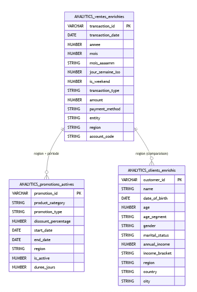

### 3.1. Table `ANALYTICS.ventes_enrichies`
**Description** : Table de faits contenant toutes les transactions de type SALE enrichies avec des dimensions temporelles pour faciliter les analyses de tendances et de saisonnalité.

**Source** : SILVER.financial_transactions_clean (filtrée sur transaction_type = 'SALE')

**Granularité** : Une ligne par transaction de vente

**Clé primaire** : transaction_id

**Colonnes**

| Colonne | Type | Description |
|---------|------|-------------|
| `transaction_id` | VARCHAR | Identifiant unique de transaction (clé de jointure) |
| `transaction_date` | DATE | Date de la transaction |
| `annee` | NUMBER | Année de la vente |
| `mois` | NUMBER | Mois (numérique 1-12) |
| `mois_aaaamm` | VARCHAR | Mois format YYYY-MM |
| `jour_semaine_iso` | NUMBER | Jour de semaine ISO (1=Lundi .. 7=Dimanche) |
| `is_weekend` | NUMBER | Flag week-end (1 si samedi/dimanche, 0 sinon) |
| `transaction_type` | VARCHAR | Type de transaction (filtré sur 'SALE') |
| `amount` | NUMBER | Montant de la transaction (>=0) |
| `payment_method` | VARCHAR | Méthode de paiement |
| `entity` | VARCHAR | Entité/point d'encaissement |
| `region` | VARCHAR | Région géographique (dimension de jointure) |
| `account_code` | VARCHAR | Compte comptable |

### 3.2. Table `ANALYTICS.promotions_actives`

**Description :** Table de dimension contenant toutes les promotions avec des indicateurs d'activité (active/inactive) et de durée, pour faciliter l'analyse d'impact des campagnes promotionnelles.

**Source :** `SILVER.promotions_clean`

**Granularité :** Une ligne par promotion

**Clé primaire :** `promotion_id`

**Colonnes**

| Colonne | Type | Description |
|---------|------|-------------|
| `promotion_id` | VARCHAR | Identifiant unique de promotion |
| `product_category` | VARCHAR | Catégorie de produit concernée |
| `promotion_type` | VARCHAR | Type de promotion (ex: discount, bundle, etc.) |
| `discount_percentage` | NUMBER | Pourcentage de remise [0,1] validé en SILVER |
| `start_date` | DATE | Date de début de la promotion |
| `end_date` | DATE | Date de fin de la promotion (NULL si illimitée) |
| `region` | VARCHAR | Région géographique (dimension de jointure) |
| `is_active` | NUMBER | Flag promotion active (1) ou inactive (0) à date du jour |
| `duree_jours` | NUMBER | Durée de la promotion en jours |


### 3.3. Table `ANALYTICS.clients_enrichis`

**Description :** Table de dimension clients enrichie avec des segments démographiques et socio-économiques calculés pour faciliter les analyses de segmentation et le ciblage marketing.

**Source :** `SILVER.customer_demographics_clean`

**Granularité :** Une ligne par client

**Clé primaire :** `customer_id`

**Colonnes**

| Colonne | Type | Description |
|---------|------|-------------|
| `customer_id` | VARCHAR | Identifiant unique client (clé de jointure) |
| `name` | VARCHAR | Nom du client |
| `date_of_birth` | DATE | Date de naissance |
| `age` | NUMBER | Âge calculé (année entière à date du jour) |
| `age_segment` | VARCHAR | Segment d'âge : '18-24', '25-34', '35-44', '45-59', '60+', 'NA' |
| `gender` | VARCHAR | Genre du client |
| `marital_status` | VARCHAR | Statut marital |
| `annual_income` | NUMBER | Revenu annuel (>=0 validé en SILVER) |
| `income_bracket` | VARCHAR | Tranche de revenu : '<20k', '20k-49k', '50k-99k', '100k+', 'NA' |
| `region` | VARCHAR | Région géographique |
| `country` | VARCHAR | Pays |
| `city` | VARCHAR | Ville |

---

## Auteur

Projet réalisé dans le cadre du cours Architecture Big Data par:
 - **FOUAISSI Mohamed Fares**
 - **AMIEL Augustin**
 - **ACHOURI Abdenour**
